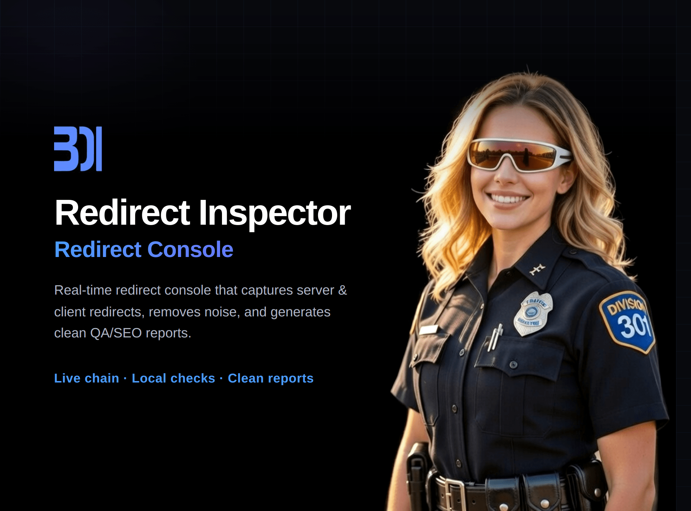

# Redirect Inspector

Real-time redirect console for developers — trace server & client redirects, run local chain analysis, filter tracking noise, copy clean reports. Zero telemetry.

[](https://chromewebstore.google.com/detail/redirect-inspector/jkeijlkbgkdnhmejgofbbapdbhjljdgg)
[](https://addons.mozilla.org/firefox/addon/redirect-inspector/)
[](https://microsoftedge.microsoft.com/addons/detail/ckblhiaefgkhpgilekhcpapnkpihdlaa)
[](LICENSE)

## Features

- **Real-time capture** — every server redirect (301, 302, 307, 308) and client-side navigation (JS, meta-refresh) recorded as it happens
- **Session grouping** — chains from the same browsing session grouped by tab, time, and domain affinity
- **9-heuristic analysis** — loops, ping-pong, long chains, mixed types, auth bounces, locale/consent, tracking noise, CDN detection, final outcome
- **Noise filtering** — tracking pixels, analytics beacons, and media sub-requests hidden by default with one-click toggle
- **Side panel** — persistent view alongside your page (Chrome/Edge sidePanel API, Firefox sidebar_action)
- **Dark & light theme** — follows system preference or toggle manually
- **One-click export** — copy chain summary or full analysis report to clipboard
- **Fully local** — no accounts, no analytics, no network requests, no data leaves your browser

## Install

| Browser | Link |
|---------|------|
| Chrome | [Chrome Web Store](https://chromewebstore.google.com/detail/redirect-inspector/jkeijlkbgkdnhmejgofbbapdbhjljdgg) |
| Firefox | [Firefox Add-ons](https://addons.mozilla.org/firefox/addon/redirect-inspector/) |
| Edge | [Edge Add-ons](https://microsoftedge.microsoft.com/addons/detail/ckblhiaefgkhpgilekhcpapnkpihdlaa) |

## How it works

Browse normally — Redirect Inspector captures every redirect chain in the background via the webRequest API. Click the toolbar icon to see grouped chains with status codes, hop counts, and timing. Hit the magnifier on any chain to run local analysis: nine heuristics check for loops, ping-pong patterns, mixed redirect types, and more. Copy the full report with one click.

Everything happens locally in the popup or side panel. No data is stored externally, transmitted, or logged.

## Development

```bash
git clone https://github.com/investblog/redirect-inspector.git
cd redirect-inspector
npm install

npm run dev            # Chrome MV3 dev server with HMR
npm run dev:firefox    # Firefox MV2 dev server
npm run build          # Chrome production build
npm run build:firefox  # Firefox production build
npm run build:edge     # Edge production build
npm run zip:all        # Build all platforms
npm run check          # Typecheck + lint + test
```

## Tech stack

- [WXT](https://wxt.dev) — web extension framework with HMR
- TypeScript strict mode
- Vanilla DOM + CSS custom properties (no framework)
- Chrome MV3 + Firefox MV2 + Edge MV3 builds
- Vitest — 74 tests across classify, helpers, and session grouping
- Zero runtime dependencies

## Privacy

Redirect Inspector makes zero network requests. No analytics, no telemetry, no remote code. Redirect data is stored in `browser.storage.local` and never leaves the browser. The only persisted preferences are theme and noise-filter toggle.

## Related

- [CookiePeek](https://github.com/investblog/cookiepeek) — privacy-first cookie manager for developers
- [301.st](https://301.st) — advanced domain management with redirects and traffic distribution

## License

[Apache 2.0](LICENSE)

---

Built by [investblog](https://github.com/investblog) at [301.st](https://301.st) with [Claude](https://claude.ai)
